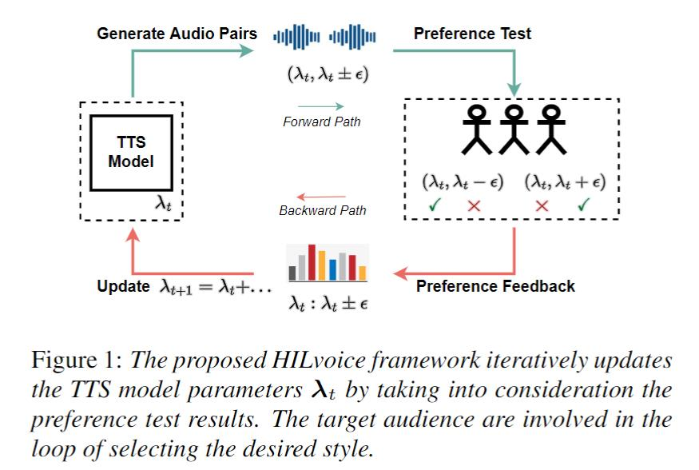
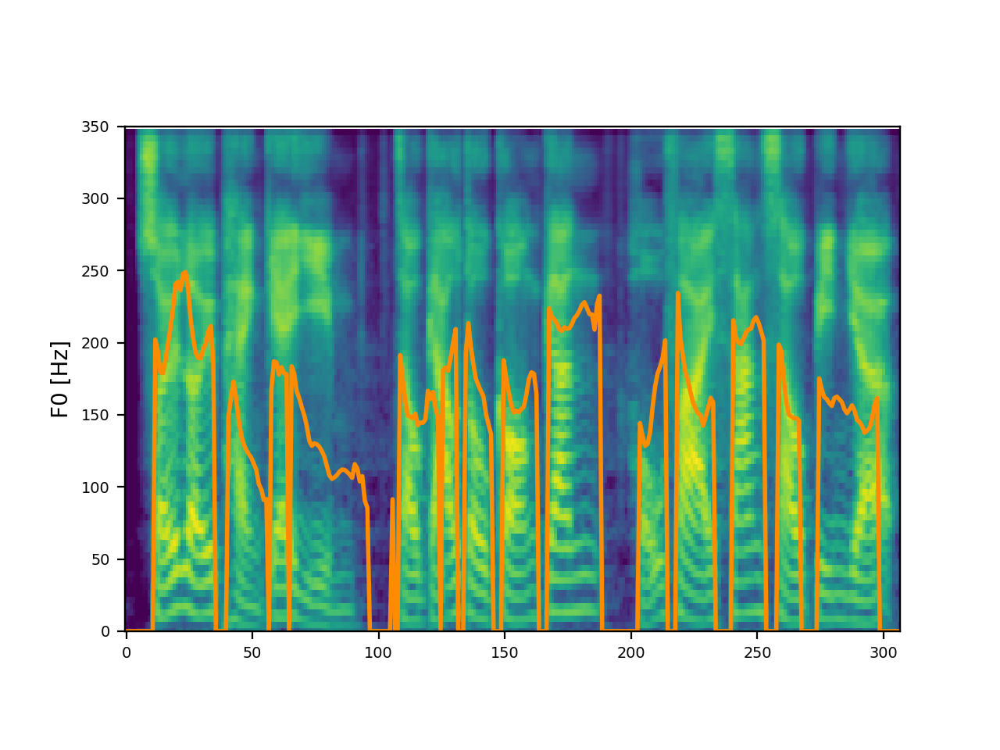
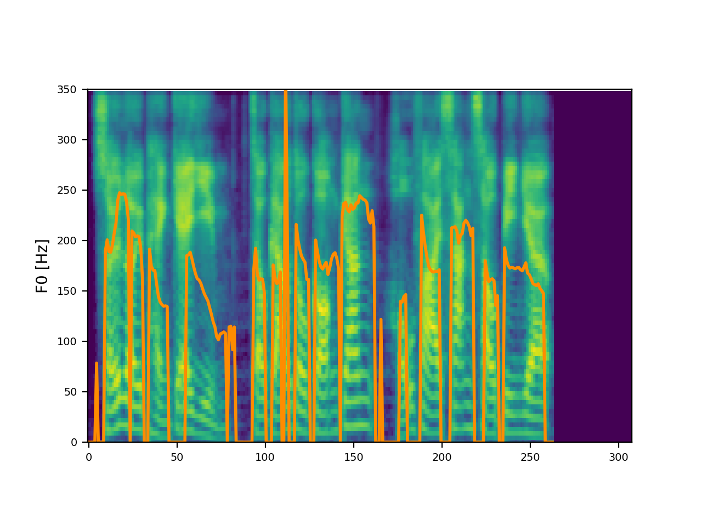
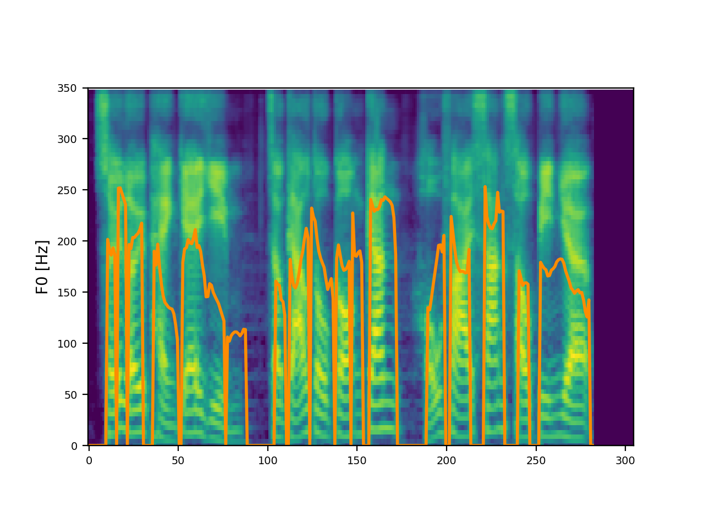

# Abstract

Controllable speech synthesis has made great progresses over the last decades. State-of-the-art systems can provide flexible interfaces for configuring the style of generated speech for targeted audience. However, for a specific audience group, e.g., the older adults, the selection of style that is favored by the group using the available configuration interfaces still needs to be investigated. Two main questions of such a style selection are (i) how to provide various options for the targeted audience to pick; and (ii) how to effectively obtain the opinions from the targeted audience. Since these two questions are highly correlated which makes it difficult to solve them separately, we propose a holistic framework to consider these two questions together by involving the targeted audience in an iterative loop. We demonstrate by experimental results that the proposed framework can successfully select a better speaker style for the older adults than the neural default setting. Analysis results show that the selected style has slower speaking rate, which coincides with previous auditory perception study results. 

# Proposed HILvoice Framework

# Preference Test Samples

|   |Cantonese text|&lambda;0|&lambda;2(explicit)|&lambda;2(implicit)|
|:--|:----------------------------------------------|:------|:------|:------|
|1|冇大块横条石压镇，墓碑可以讲系一挖就倒。|<audio controls><source src="./wavs/0-01.wav" type="audio/wav"></audio>|<audio controls><source src="./wavs/2x-01.wav" type="audio/wav"></audio>|<audio controls><source src="./wavs/2y-01.wav" type="audio/wav"></audio>|
|2|例如宴會、音樂演奏會、受勳儀式咁。|<audio controls><source src="./wavs/0-02.wav" type="audio/wav"></audio>|<audio controls><source src="./wavs/2x-02.wav" type="audio/wav"></audio>|<audio controls><source src="./wavs/2y-02.wav" type="audio/wav"></audio>|
|3|希望为啲新书宣传速销。|<audio controls><source src="./wavs/0-03.wav" type="audio/wav"></audio>|<audio controls><source src="./wavs/2x-03.wav" type="audio/wav"></audio>|<audio controls><source src="./wavs/2y-03.wav" type="audio/wav"></audio>|
|4|包括蝶式、背泳、蛙泳式、自由式四種泳式。|<audio controls><source src="./wavs/0-04.wav" type="audio/wav"></audio>|<audio controls><source src="./wavs/2x-04.wav" type="audio/wav"></audio>|<audio controls><source src="./wavs/2y-04.wav" type="audio/wav"></audio>|
|5|劉千石響立法會政改方案投下棄權票。|<audio controls><source src="./wavs/0-05.wav" type="audio/wav"></audio>|<audio controls><source src="./wavs/2x-05.wav" type="audio/wav"></audio>|<audio controls><source src="./wavs/2y-05.wav" type="audio/wav"></audio>|
|6|呢的古本比較現在呢三個流通版本多咗或小咗一的經卷。|<audio controls><source src="./wavs/0-06.wav" type="audio/wav"></audio>|<audio controls><source src="./wavs/2x-06.wav" type="audio/wav"></audio>|<audio controls><source src="./wavs/2y-06.wav" type="audio/wav"></audio>|
|7|佢確立揸住朱印狀者先准做貿易嘅朱印船制度。|<audio controls><source src="./wavs/0-07.wav" type="audio/wav"></audio>|<audio controls><source src="./wavs/2x-07.wav" type="audio/wav"></audio>|<audio controls><source src="./wavs/2y-07.wav" type="audio/wav"></audio>|
|8|荣华东街、旧豆栏、拱日门、鸡栏之庙；|<audio controls><source src="./wavs/0-08.wav" type="audio/wav"></audio>|<audio controls><source src="./wavs/2x-08.wav" type="audio/wav"></audio>|<audio controls><source src="./wavs/2y-08.wav" type="audio/wav"></audio>|
|9|亦有啲卡巴係以薯條取代土耳其麵包當餸嚟食嘅；|<audio controls><source src="./wavs/0-09.wav" type="audio/wav"></audio>|<audio controls><source src="./wavs/2x-09.wav" type="audio/wav"></audio>|<audio controls><source src="./wavs/2y-09.wav" type="audio/wav"></audio>|
|10|透過唔同心法令敵人勁氣落空又或將之引乜，|<audio controls><source src="./wavs/0-10.wav" type="audio/wav"></audio>|<audio controls><source src="./wavs/2x-10.wav" type="audio/wav"></audio>|<audio controls><source src="./wavs/2y-10.wav" type="audio/wav"></audio>|
|11|小葉嚟到坐咗喺劃畫老師後面個位預備郁手。|<audio controls><source src="./wavs/0-11.wav" type="audio/wav"></audio>|<audio controls><source src="./wavs/2x-11.wav" type="audio/wav"></audio>|<audio controls><source src="./wavs/2y-11.wav" type="audio/wav"></audio>|
|12|家下拍烏蠅未必要拍死佢咁暴力。|<audio controls><source src="./wavs/0-12.wav" type="audio/wav"></audio>|<audio controls><source src="./wavs/2x-12.wav" type="audio/wav"></audio>|<audio controls><source src="./wavs/2y-12.wav" type="audio/wav"></audio>|
|13|严防极端分子威胁负责选务官员安全。|<audio controls><source src="./wavs/0-13.wav" type="audio/wav"></audio>|<audio controls><source src="./wavs/2x-13.wav" type="audio/wav"></audio>|<audio controls><source src="./wavs/2y-13.wav" type="audio/wav"></audio>|
|14|计划嘅路线分为三大部份。|<audio controls><source src="./wavs/0-14.wav" type="audio/wav"></audio>|<audio controls><source src="./wavs/2x-14.wav" type="audio/wav"></audio>|<audio controls><source src="./wavs/2y-14.wav" type="audio/wav"></audio>|
|15|水裏便嘅鹽就搞到鋼筋好快生鏽變弱。|<audio controls><source src="./wavs/0-15.wav" type="audio/wav"></audio>|<audio controls><source src="./wavs/2x-15.wav" type="audio/wav"></audio>|<audio controls><source src="./wavs/2y-15.wav" type="audio/wav"></audio>|

# Case Study

Cantonese text: 水裏便嘅鹽就搞到鋼筋好快生鏽變弱。

|&lambda;|Audio|Mel-spectrogram|
|:---|:-------------|:---------------------|
|&lambda;2(explicit)|<audio controls><source src="./wavs/2x-15.wav" type="audio/wav"></audio>||
|&lambda;0|<audio controls><source src="./wavs/0-15.wav" type="audio/wav"></audio>||
|&lambda;2(implicit)|<audio controls><source src="./wavs/2y-15.wav" type="audio/wav"></audio>||
